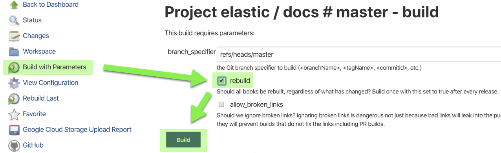

# Releasing a new version

This guide aims to provide guidance on how to release new versions of the `ecctl` binary as well as updating all the necessary parts to make it successful. The release will happen automatically via GitHub actions, but there are a few prerequisites to tick before that can be started.

- [Releasing a new version](#releasing-a-new-version)
  - [Prerequisites](#prerequisites)
    - [Verify a release in `cloud-sdk-go` has been made](#verify-a-release-in-cloud-sdk-go-has-been-made)
    - [Make sure the version has been updated](#make-sure-the-version-has-been-updated)
    - [Generating a changelog for the new version](#generating-a-changelog-for-the-new-version)
  - [Executing the release](#executing-the-release)
  - [Post release requirements](#post-release-requirements)
    - [Approve the updated `homebrew-tap` formula.](#approve-the-updated-homebrew-tap-formula)
    - [Create documentation specific to the release (Minor and Major only)](#create-documentation-specific-to-the-release-minor-and-major-only)
    - [Update downloads website](#update-downloads-website)

## Prerequisites

Before starting any release, make sure to open a release checklist [issue](https://github.com/elastic/ecctl/issues/403) using the provided release [template](https://github.com/elastic/ecctl/issues/new?assignees=&labels=Team%3ADelivery&template=RELEASE_CHECKLIST.md).

Releasing a new version of the binary implies that there have been changes in the source code which are meant to be released for wider consumption. Before releasing a new version there's some prerequisites that have to be checked.

### Verify a release in `cloud-sdk-go` has been made

Unless this is a patch release, make sure a `cloud-sdk-go` release with the same version has been made. Once this is done, the `cloud-sdk-go` dependency should be updated to that version. To update the cloud-sdk-go dependency, please use the following command in the root of the project: `make update-cloud-sdk-go`.

### Make sure the version has been updated

**Since the version updates are now automated via github actions, this is just a double check**

Since the source has changed, we need to update the current committed version to a higher version so that the release is published.

The version is currently defined in the [Makefile](./Makefile) as an exported environment variable called `VERSION` in the [SEMVER](https://semver.org) format: `MAJOR.MINOR.BUG`

```Makefile
SHELL := /bin/bash
export VERSION ?= v1.0.0
```

Say we want to perform a minor version release (i.e. no breaking changes and only new features and bug fixes are being included); in which case we'll update the _MINOR_ part of the version, this can be done with the `make minor` target, but it should have been updated automatically via GitHub actions.

```Makefile
SHELL := /bin/bash
export VERSION ?= v1.1.0
```

If a patch version needs to be released, the release will be done from the minor branch. For example, if we want to release `v1.5.1`, we will check out the `1.5` branch and perform any changes in that branch. The VERSION variable in the Makefile should already be up to date, but in case it's not, it can be bumped with the `make patch` target.

### Generating a changelog for the new version

Once the version is updated, we can then generate the changelog and release notes by calling `make changelog`.

Take a look at one of our previous releases [`v1.5.0.adoc`](../docs/release_notes/v1.5.0.adoc) and the [template](../scripts/changelog.tpl.adoc) we use to generate them. The idea is to fill all the applicable sections so that users can consume easily.

After the release notes have been manually curated, a new pull request can be opened with the changelog and release notes.

## Executing the release

After the new changelog and version have been merged to master, the only thing remaining is to run `make tag`. This is the makefile target which will push the GitHub tag and will trigger the corresponding [GitHub action](.github/workflows/release.yml) which will release ecctl.

## Post release requirements

After a release has been performed there are still a few things we need to do.

### Approve the updated `homebrew-tap` formula.

The release process will open a pull request against the [`homebrew-tap`](https://github.com/elastic/homebrew-tap/pulls) repository, which needs to be approved and merged, see <https://github.com/elastic/homebrew-tap/pull/98> as an example.

### Create documentation specific to the release (Minor and Major only)

In order to have the documentation live for our new release we need to modify the conf.yaml file in the docs repository to [add the release branch](https://github.com/elastic/docs/blob/master/conf.yaml#L837) and have the build [point to our new branch](https://github.com/elastic/docs/blob/master/conf.yaml#L836).

Once the PR for the above changes has been merged, you'll need to run a full doc [rebuild](https://elasticsearch-ci.elastic.co/job/elastic+docs+master+build/build?delay=0sec) to make the new release branch the default docs.



### Update downloads website

Once the release is done and the documentation is live, you'll need to get in touch with the marketing team to update the [downloads website](https://www.elastic.co/downloads/ecctl) with the correct links and information.

To do this you'll need to open up an issue similar to [this](https://github.com/elastic/website-www.elastic.co/issues/7163) one. In that issue you'll see a link to a google doc, do **NOT** directly edit this doc, but rather add as suggestions the changes to the links and information. The marketing team is pretty quick to answer, but should they miss this issue for some reason you can ping them in the #marketing channel.

There is an open [issue](https://github.com/elastic/ecctl/issues/428) to automate this process, but we've not had the bandwidth to dedicate time to work on this.
